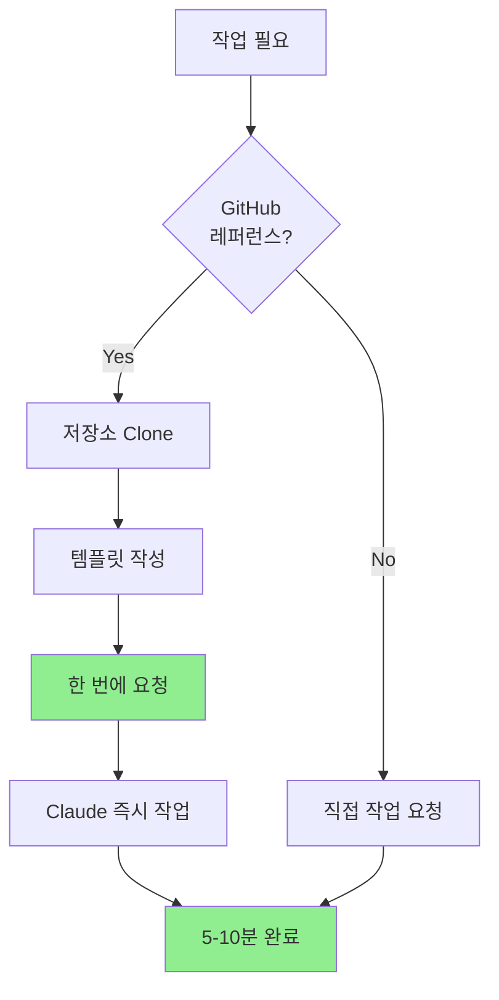
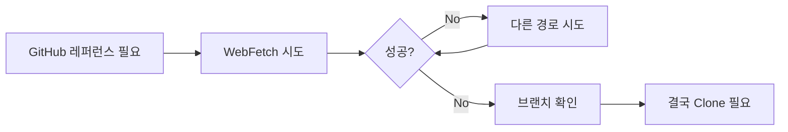

# GitHub 레퍼런스 코드 참조 작업 가이드

**작성일:** 2025-11-06
**목적:** Claude Code에서 GitHub 레퍼런스 프로젝트를 효율적으로 참조하는 방법

---

## 문제 상황 요약

### 발생한 문제

**레퍼런스 저장소:** https://github.com/trionking/stm32h523-spi-hardware-nss-dma

**증상:**
- Claude Code에서 GitHub raw 파일 접근 시 404 오류 발생
- 여러 경로 시도했으나 실패
  - `/blob/main/` → 404
  - `/raw/main/` → 404
  - `/raw/refs/heads/main/` → 404

**근본 원인:**
1. **브랜치 이름 불일치:** 저장소가 `master` 브랜치를 사용하는데 `main`으로 접근 시도
2. **WebFetch 도구의 제약:** GitHub 리디렉션 처리 시 간헐적 실패

---

## 해결 방법

### 최종 성공한 방법

1. **로컬 클론 후 Read 도구 사용**
   ```bash
   cd D:\work\try\HYiot\work\sign_telecom\audio_bd\sw\cb_audio_mux
   git clone https://github.com/trionking/stm32h523-spi-hardware-nss-dma.git
   ```

2. **Claude Code에서 로컬 파일 접근**
   ```
   Read: D:\work\try\HYiot\work\sign_telecom\audio_bd\sw\cb_audio_mux\stm32h523-spi-hardware-nss-dma\Core\Inc\ring_buffer.h
   ```

### 왜 Clone이 필요했는가?

| 방법 | 장점 | 단점 | 결과 |
|------|------|------|------|
| **WebFetch (GitHub raw)** | 빠름, 로컬 저장소 불필요 | 브랜치 이름 의존, 리디렉션 실패 가능 | ❌ 실패 |
| **로컬 Clone + Read** | 안정적, 전체 파일 접근, 버전 관리 | 초기 다운로드 필요 | ✅ 성공 |

**Clone이 필수인 이유:**
- ✅ 브랜치 이름과 무관하게 작동 (git이 자동으로 기본 브랜치 체크아웃)
- ✅ 여러 파일을 반복적으로 읽을 때 효율적 (네트워크 요청 불필요)
- ✅ 안정적인 파일 접근 (Read 도구는 로컬 파일 시스템에 최적화)
- ✅ 전체 프로젝트 구조 탐색 가능 (Glob, Grep 사용 가능)

---

## 사용자를 위한 효율적인 작업 요청 가이드

> **이 섹션은 Claude Code와 작업하는 개발자/관리자를 위한 가이드입니다.**

### ✅ 한 번에 작업이 완료되도록 요청하는 방법

GitHub 레퍼런스 코드를 참고하여 작업을 요청할 때, 다음 정보를 **한 번에 모두** 제공하면 시행착오 없이 바로 작업이 진행됩니다.

#### 필수 정보 체크리스트

- [ ] **GitHub 저장소 URL** (참고용)
- [ ] **로컬 Clone 경로** (절대 경로)
- [ ] **참고할 기능/파일** (어떤 코드를 참고할지)
- [ ] **적용 대상** (현재 프로젝트의 어느 부분에 적용할지)
- [ ] **기대 결과** (최종적으로 원하는 동작)

---

### 좋은 요청 예시 (✅ Efficient)

```
"https://github.com/trionking/stm32h523-spi-hardware-nss-dma 의
논블럭 printf 구현을 참고해서 현재 프로젝트(STM32H723, UART2)에 적용해줘.

로컬 clone 경로: D:\work\try\HYiot\work\sign_telecom\audio_bd\sw\cb_audio_mux\stm32h523-spi-hardware-nss-dma

참고 파일:
- Core/Inc/ring_buffer.h/c - Queue 구현
- Core/Inc/user_com.h/c - UART DMA TX 처리
- Core/Src/user_def.c - __io_putchar() 구현

적용 대상:
- 현재 프로젝트의 UART2 (huart2)
- printf() 함수를 논블럭 형태로 변경

기대 결과:
- printf() 호출 시 블럭되지 않고 Queue에 저장
- 백그라운드 DMA 전송으로 UART2 출력
- 메인 루프에서 UART2_Process_TX_Queue() 호출
"
```

**예상 처리 시간:** 5-10분 (분석 + 구현 + 빌드)

**Claude의 작업 플로우:**
1. 로컬 경로에서 참고 파일 읽기 (Read 도구)
2. ring_buffer, user_com 코드 분석
3. 현재 프로젝트에 맞게 수정 (UART3 → UART2)
4. 파일 생성/수정
5. 빌드 확인

---

### 나쁜 요청 예시 (❌ Inefficient)

#### 예시 1: 정보 부족
```
"GitHub에서 코드 가져와서 적용해줘"
```
**문제점:**
- ❌ GitHub URL이 없음
- ❌ 무엇을 참고할지 불명확
- ❌ 어디에 적용할지 불명확

**결과:** Claude가 추가 질문 필요 → 여러 번 왕복 → 10-20분 소요

---

#### 예시 2: URL만 제공
```
"https://github.com/trionking/stm32h523-spi-hardware-nss-dma 참고해줘"
```
**문제점:**
- ❌ 로컬 clone 경로 없음 → Claude가 WebFetch 시도 → 실패 가능
- ❌ 무엇을 참고할지 불명확
- ❌ 적용 방법 불명확

**결과:** Clone 요청 → 사용자 작업 → 추가 설명 → 15-20분 소요

---

#### 예시 3: Clone 없이 URL만
```
"https://github.com/xxx/yyy 코드를 적용해줘 (Clone 안 함)"
```
**문제점:**
- ❌ WebFetch 도구로 GitHub raw 파일 접근 시도
- ❌ 브랜치 이름 불일치 가능 (main vs master)
- ❌ 여러 파일 읽기 시 매번 네트워크 요청
- ❌ 실패 확률 높음

**결과:** 여러 번 시도 → 결국 Clone 요청 → 20-30분 소요

---

### 작업 요청 템플릿

아래 템플릿을 복사해서 사용하면 효율적입니다:

```
[작업 요청]

레퍼런스: [GitHub URL]
로컬 경로: [절대 경로]

참고 파일:
- [파일 경로 1] - [기능 설명]
- [파일 경로 2] - [기능 설명]

적용 대상:
- [현재 프로젝트 파일/페리페럴]
- [변경할 내용]

기대 결과:
- [원하는 동작 1]
- [원하는 동작 2]

추가 요구사항:
- [옵션: 빌드 여부, 테스트 방법 등]
```

---

### 실제 사용 예시 (이번 프로젝트)

```
[작업 요청]

레퍼런스: https://github.com/trionking/stm32h523-spi-hardware-nss-dma
로컬 경로: D:\work\try\HYiot\work\sign_telecom\audio_bd\sw\cb_audio_mux\stm32h523-spi-hardware-nss-dma

참고 파일:
- Core/Inc/ring_buffer.h - Queue 구조체 정의
- Core/Src/ring_buffer.c - Enqueue/Dequeue 구현
- Core/Inc/user_com.h - UART DMA TX 함수 선언
- Core/Src/user_com.c - UART3_Process_TX_Queue() 구현
- Core/Src/user_def.c - __io_putchar() 큐 기반 구현

적용 대상:
- 현재 프로젝트 STM32H723 (audio_mux_v101)
- UART2 (huart2) 디버그 출력
- printf() 논블럭 변환

기대 결과:
- printf() 호출 시 큐에 저장 후 즉시 리턴
- 백그라운드 DMA 전송으로 UART2 출력
- 메인 루프에서 UART2_Process_TX_Queue() 주기적 호출
- 빌드 성공 확인

추가 요구사항:
- 플래시는 하지 말고 빌드만 (CubeIDE에서 직접 플래시)
```

**처리 결과:** 5분 내 완료 (파일 읽기 → 코드 적용 → 빌드)

---

### 시간 비교 (실제 경험 기반)

| 요청 방법 | 정보 완성도 | 예상 시간 | 왕복 횟수 |
|----------|------------|----------|----------|
| **✅ 모든 정보 제공 (템플릿 사용)** | 100% | 5-10분 | 1회 |
| **URL + Clone 경로만** | 60% | 10-15분 | 2-3회 |
| **URL만 (Clone 없음)** | 40% | 15-25분 | 3-5회 |
| **"GitHub 참고해줘"** | 20% | 20-30분 | 5-10회 |

---

### 효율적인 작업 흐름 요약



---

## 효율적인 작업 지침 (Best Practice)

### 1단계: 사전 확인

GitHub 저장소 레퍼런스가 필요한 경우, **먼저 사용자에게 확인:**

```
"해당 GitHub 저장소를 로컬에 clone해서 경로를 알려주시면
안정적으로 파일을 참조할 수 있습니다.
다음 명령어로 clone해주세요:

git clone https://github.com/[owner]/[repo].git

완료 후 clone된 절대 경로를 알려주시면 작업을 진행하겠습니다."
```

### 2단계: 로컬 Clone 경로 확인

사용자가 제공한 경로 예시:
```
D:\work\try\HYiot\work\sign_telecom\audio_bd\sw\cb_audio_mux\stm32h523-spi-hardware-nss-dma
```

### 3단계: 필요한 파일 식별 및 읽기

**Glob으로 파일 검색:**
```
Glob: stm32h523-spi-hardware-nss-dma/**/*.h
Glob: stm32h523-spi-hardware-nss-dma/**/*ring_buffer*
```

**Read로 파일 읽기:**
```
Read: D:\work\...\stm32h523-spi-hardware-nss-dma\Core\Inc\ring_buffer.h
Read: D:\work\...\stm32h523-spi-hardware-nss-dma\Core\Src\ring_buffer.c
```

### 4단계: 코드 분석 및 적용

- 레퍼런스 코드 분석
- 현재 프로젝트에 맞게 수정
- 필요한 부분만 이식

---

## 향후 작업 플로우

### ✅ 권장 방법 (Efficient)


**예상 소요 시간:** 2-3분 (사용자 clone 작업 포함)

### ❌ 비효율적 방법 (Avoid)



**예상 소요 시간:** 10-15분 (여러 시행착오 포함)

---

## GitHub Raw 파일 접근 참고 (선택적)

만약 WebFetch를 시도할 경우 체크리스트:

### 브랜치 이름 확인
- [ ] 저장소의 기본 브랜치 확인 (main vs master)
- [ ] GitHub 웹 UI에서 "Branch: main" 또는 "Branch: master" 확인

### 올바른 Raw URL 형식
```
# ✅ 올바른 형식
https://raw.githubusercontent.com/[owner]/[repo]/[branch]/[path]

# 예시 (master 브랜치)
https://raw.githubusercontent.com/trionking/stm32h523-spi-hardware-nss-dma/master/Core/Inc/ring_buffer.h

# 예시 (main 브랜치)
https://raw.githubusercontent.com/owner/repo/main/src/file.c
```

### 공개/비공개 저장소
- [ ] Public 저장소인지 확인 (WebFetch는 인증 불가)
- [ ] Private 저장소는 반드시 로컬 Clone 필요

---

## 실제 적용 사례

### 이번 프로젝트 (stm32h523-spi-hardware-nss-dma)

**목적:** 논블럭 printf() 구현을 위한 레퍼런스 코드 참조

**참조한 파일:**
1. `Core/Inc/ring_buffer.h` - Queue 구조체 정의
2. `Core/Src/ring_buffer.c` - Queue 구현 (Enqueue, Dequeue)
3. `Core/Inc/user_com.h` - UART DMA TX 함수 선언
4. `Core/Src/user_com.c` - UART3_Process_TX_Queue() 구현
5. `Core/Src/user_def.c` - __io_putchar() 구현

**결과:**
- ✅ 모든 파일 성공적으로 읽기 완료
- ✅ 코드 분석 및 STM32H723 프로젝트 적용 준비 완료

---

## 체크리스트: 레퍼런스 코드 참조 작업

- [ ] 1. GitHub 저장소 URL 확인
- [ ] 2. 사용자에게 로컬 Clone 요청
- [ ] 3. Clone된 절대 경로 확인
- [ ] 4. Glob으로 필요한 파일 검색
- [ ] 5. Read로 파일 내용 읽기
- [ ] 6. 코드 분석 및 현재 프로젝트 적용
- [ ] 7. 빌드 및 테스트

---

## 요약

### 핵심 교훈

1. **GitHub 레퍼런스 코드 참조 시 로컬 Clone이 가장 안정적**
2. **WebFetch는 브랜치 이름 의존성으로 인해 불안정**
3. **Clone 후 Read 도구 사용이 가장 효율적인 워크플로우**

### 권장 사항

> **GitHub 레퍼런스가 필요한 경우, 처음부터 사용자에게 Clone을 요청하고
> 로컬 경로를 받아서 Read 도구로 직접 파일을 읽는 것이 가장 빠르고 안정적입니다.**

---

**문서 버전:** 1.0
**다음 업데이트:** 추가 사례 발생 시
